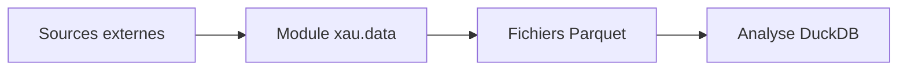

# StockGenius XAU

[](https://github.com/GordoxGit/StockGeniusXAU/actions/workflows/ci.yml)
[](https://codecov.io/gh/GordoxGit/StockGeniusXAU)

## Vision

StockGenius XAU vise à fournir un assistant de décision sur l'or spot (XAU/USD) conforme à la réglementation financière.

## Architecture

Le projet suit une structure modulaire permettant l'extension future des composants de données, signaux et exécution.



## Pré-requis

Ce projet nécessite **Python ≥ 3.11** et est testé en CI sous **Python 3.11 et 3.12**.

La documentation détaillée se trouve dans `docs/data_ingestion.md`.

## Roadmap

La feuille de route complète est détaillée dans le fichier `roadmap` à la racine du dépôt.

## Conformité RTS 6

La conformité à la directive MiFID II et aux exigences RTS 6 est documentée dans `docs/compliance/RTS6_checklist.md`.

## ⚠️ Configuration des secrets CI

Pour utiliser la publication de la couverture, créez les secrets :

- `CODECOV_TOKEN` pour l'upload Codecov.
- `COVERALLS_REPO_TOKEN` (requis si `USE_COVERALLS` vaut `true`).

Le token Codecov se génère depuis votre tableau de bord Codecov
(`Settings → Upload Token`). Une fois obtenu, ajoutez-le dans GitHub comme
`CODECOV_TOKEN` via **Settings → Secrets and variables → Actions**.

## Dépendances optionnelles

Certaines fonctionnalités d'exécution s'appuient sur la bibliothèque
`MetaTrader5`. Celle-ci n'est disponible que sur **Windows** et ne propose des
roues que pour Python 3.11. L'installation peut se faire via l'extra
`mt5` :

```bash
pip install .[mt5]
```

Sur Linux ou avec Python 3.12+, l'import est automatiquement moqué et les tests
concernés sont ignorés.
